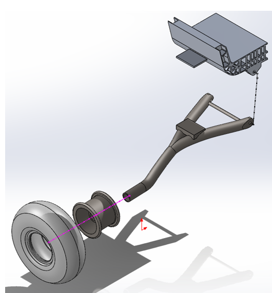
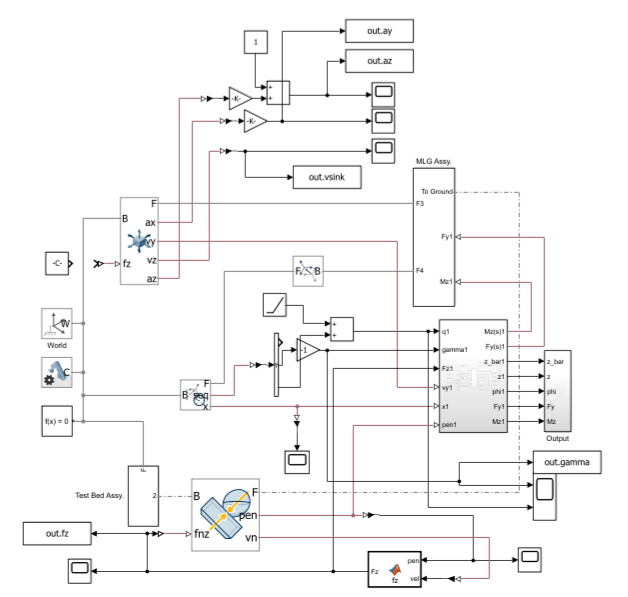

# **vLGDT-Simulation**
This project was made as my undergraduate thesis for Bachelor of Engineering. However, the method may have further application and may be implemented for other ground maneuvers and/or landing gear geometry.
# **Background**
Aircraft landing gears, being the medium between the ground and other parts of aircraft structures, is one of, if not, the most important structure in an aircraft. However, due to the demanding nature of its operating conditions, aircraft landing gear may contribute up to 5% of the aircraft whole weight (Niu,1989). Thus, much effort is made to reduce its weight while still allow it to fulfill its purpose. 
Virtual Landing Gear Drop Test (vLGDT) is a way of moving the cost-intensive and time-consuming method of landing gear structure test to the virtual world by modeling the landing gear geometry and its material properties.
# **Objectives**
A lot of study has been made into modelling landing gear for vLGDT. However, most study only focusses on determining the load over the longitudinal (due to drag/tire spin-up) and vertical axis. This project is not only aim to find the lateral load experienced by an aircraft tire during landing, but also investigate the structural responses. Furthermore, in this project, I will compare the use of rigid multibody simulation (RMBS) and flexible multibody simulation (FMBS) to see if there is a significant difference between the two assumptions.
# **Methods**
Landing gear used is modelled after PTDI N219 main landing gear structure. A paper published by BRIN investigates the vertical contact force experienced by the tire and used as the main reference of this study. The model of pneumatic tire deformation is based on the seminal paper of Boris v. Schlippe and R. Dietrich (1941) where tire lateral deformation is modelled after a stretched string.

Simulation is done using MATLAB R2026a for simulation pre- and post-processing. Solving the dynamics between parts and the world is done using Simscape Multibody, an add-on for Simulink. Building the finite element model is done by the FEModel.mlx code. This code also reduced the number of vibration modes to only consider the more significant mode of vibration (lower modal frequency). FEModel.mlx takes the .stl file of each geometry and build the FE matrix based on the material properties of the part. Damping coefficient is calculated based on Rayleigh Proportional Damping Matrix.

#**Results**
Several simulations were done. These simulations were built on top of each other as sort of milestones to verify the final simulation result.
1.  First simulation was done to validate the overall model of the structure. The process is done to mimic the result obtained by Hidayat (2019) which was the main comparison as he used the same model, although with only RMBS assumption. Simulation shows a good agreement between the two results
2.  Second simulation was done by assuming the landing gear leg as a flexible structure. The result then compared to the result obtained from the first simulation. However, the difference is small (about 1%) thus shows that RMBS is preferred for 1D load investigation (usually vertical). For other loading direction, FMBS is needed due to the limiting degree of freedom.
3.  Third simulation was done to validate the pneumatic tire deformation model built using the MATLAB Function within Simulink. Simulation is conducted based on the experiment method and normalized results given by S.K. Clark, G.H. Nybakken, and G.R. Dodge (1970). Result shows a good correlation between experiment data. However, this only applies for small slip angle, since von Schlippe and Dietrich string model tends to overestimate realigning moment at large slip angle.
4.  Fourth simulation was done to investigate the combination of vertical drop and side force effect on a landing gear structure. Comparing the result with the second simulation shows a difference in stress distribution and deformation. The tire realigning moment causes higher stress at the side of the leg.

